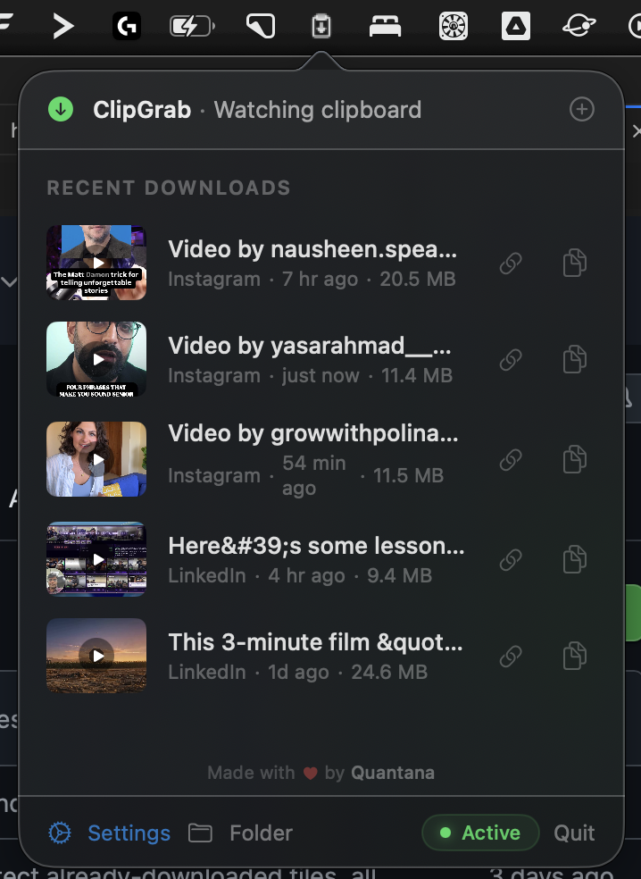

# ClipGrab

ClipGrab monitors your clipboard for social media URLs and automatically downloads the video or photo at the highest available quality, converts it to MP4, and places it back on your clipboard — ready to paste anywhere.

**Made with love by [Quantana](https://quantana.com.au)**



## Download

| Platform | Download | Status |
|----------|----------|--------|
| **macOS** | [ClipGrab.dmg](https://github.com/vishalquantana/clipgrab/releases/latest) | Stable |
| **Windows** | See [Windows setup](#windows-setup) below | Beta — needs feedback! |

## Features

- Monitors clipboard for social media URLs — just copy a link and it downloads automatically
- Choose download quality: Best, 1080p, 720p, or Audio only (MP3)
- Automatically converts video to MP4 via ffmpeg
- Extract and copy just the audio (MP3) from any downloaded video with one click
- Places the downloaded file directly on your clipboard — paste into Slack, iMessage, email, etc.
- Paste URL manually via the + button in the dropdown
- Large video thumbnail previews with hover-to-play
- Download history with one-click re-copy
- Copy original URL or downloaded media independently

## Supported Platforms

| Platform | Status |
|----------|--------|
| Instagram | Supported |
| YouTube | Supported |
| TikTok | Supported |
| Twitter/X | Supported (public tweets with video) |
| Reddit | Supported |
| Facebook | Supported (public videos) |
| Threads | Supported |
| Vimeo | Supported |
| Pinterest | Supported |
| Twitch (clips) | Supported |
| LinkedIn | Supported (public posts) |

## macOS

### Install from DMG

1. Download `ClipGrab.dmg` from [Releases](https://github.com/vishalquantana/clipgrab/releases/latest)
2. Open the DMG and drag ClipGrab to Applications
3. Launch ClipGrab — it lives in your menu bar
4. On first launch, it will help you install `yt-dlp` and `ffmpeg` via Homebrew

### Build from source

```bash
cd macos
swift build -c release
bash build_app.sh
open ClipGrab.app
```

### Requirements

- macOS 13 (Ventura) or later
- Python 3.9+
- [yt-dlp](https://github.com/yt-dlp/yt-dlp)
- [ffmpeg](https://ffmpeg.org/)

## Windows Setup

> **Beta**: The Windows version is functional but has not been extensively tested. We'd love your feedback! Please [open an issue](https://github.com/vishalquantana/clipgrab/issues) if you run into problems.

### Requirements

- Python 3.9+
- [yt-dlp](https://github.com/yt-dlp/yt-dlp) (install via `pip install yt-dlp`)
- [ffmpeg](https://ffmpeg.org/) (download and add to PATH)

### Install & Run

```bash
# Clone the repo
git clone https://github.com/vishalquantana/clipgrab.git
cd clipgrab

# Install Windows dependencies
pip install -r windows/requirements.txt

# Install the download engine dependencies
pip install yt-dlp

# Run the tray app
python windows/tray_app.py
```

ClipGrab will appear in your system tray. Copy any supported social media URL and it will automatically download the media to `~/Downloads/ClipGrab/`.

## Architecture

ClipGrab is built with two layers:

- **UI shell** — Platform-specific (Swift/SwiftUI on macOS, Python/pystray on Windows)
- **Shared download engine** (`engine/download_manager.py`) — Handles URL detection, media downloading via `yt-dlp`, and MP4 conversion via `ffmpeg`. Outputs JSON lines to stdout.

The same Python engine is used on both platforms. Only the UI and clipboard access differ per OS.

## About Quantana

ClipGrab is built by [Quantana](https://quantana.com.au), an AI-first advisory and consultancy firm. We partner with Fortune 500 companies to co-build AI-powered products and advise leaders on implementing AI securely, safely, and scalably across their organizations.

## License

MIT License — see [LICENSE](LICENSE) for details.
